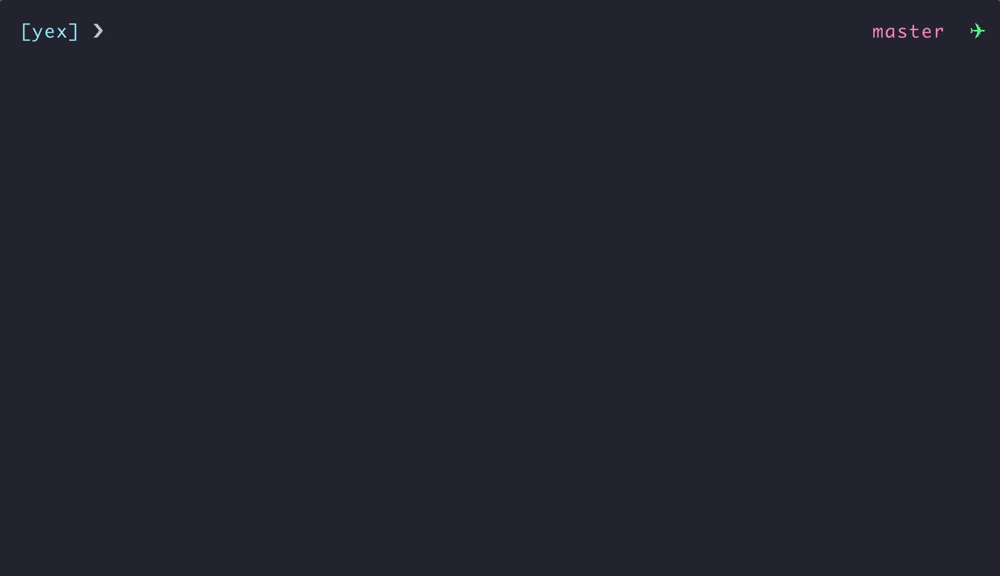

<div align="center">
  <h1>Yex 🦖</h1>
</div>

<p align="center">
  <strong>Yarn Explorer</strong>
</p>

<p align="center">
  <a href="https://github.com/epilande/yex/blob/master/LICENSE"></a>
  <a href="https://www.npmjs.com/package/yex"></a>
</p>

<div align="center">
  
</div>

## Why?

Ever get lost in your yarn workspaces?
Always forgetting what commands you have available?
Spending a lot of time traversing through workspaces and `package.json`?
Tired of writing `yarn workspace <workspace-name>`?
You want an overview of available scripts and a preview of the command?

## Solution

This is an interactive CLI tool that will parse through your `package.json`'s and display an overview of your workspaces and available scripts.
From there, you can fuzzy find available workspaces and scripts, run commands, and add additional arguments.

This tool aims to improve discoverability and make it easier to work with `yarn workspaces` and your JavaScript applications.

## Installation

```bash
$ npx yex
# OR
$ npm install -g yex
```

## License

[MIT License](https://oss.ninja/mit/epilande/)
